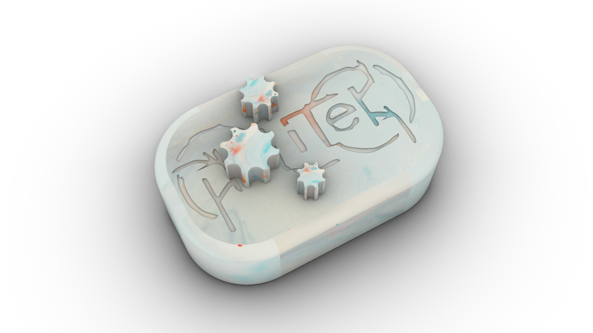

<h1 align="center">
	<br>
		
	<br>
		TS741
	<br>
</h1>

# PoliWhanm - Experimental Wah-Pedal

## Configuration
```bash
git clone https://github.com/Voltage01/PoliWhamn.git
```

## Structure of the Project
```
PoliWhanm/
├── Hardware/
│   ├── Schematics of the Design/
│   ├── PCB Design/
│   └── Component Models/
│
└── Software/
    ├── Master/           # Master ESP32 
    ├── Slave/            # Slave ESP32
```

## Instructions to Build

### Prerequisites
- Prefered IDE installed (VS Code, Arduino IDE, ...)
- Required libraries added (TBA)
- Listed components obtained alongside with the PCB design or on breadboard with cables if prefered

### Completion of the Project
1. Do the solderings or the cableings with the guideline schematic.
2. Upload the respective code files (master and slave) to the respective MCUs.
3. Connect the power supplies and try it on.

### Compliation of the Libraries
TBA

TBA in more detail later.
